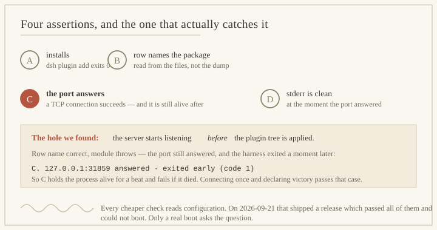

# dsh-zcode-scribe

[](https://github.com/BOWLUNA/dsh-zcode-scribe/actions/workflows/test.yml)
[](LICENSE)
[](#兼容性)
[](#兼容性)

`v1.0.0` · 在 dsh `>=0.1.5-rc.2 <0.2.0 || >=0.1.6-alpha.1 <0.2.0` 上开发并验证过。

**给 [DeepSeek Harness](https://github.com/deepseek-ai/deepseek-harness) 的长期记忆——写记忆的那个组件是一个被收窄了权限的子代理。**

```bash
dsh plugin --profile web add dsh-zcode-scribe
```



> **状态：早期，只读。** `scribe_recall` 工具已注册、**在真实实例里真被执行**，
> 且一次**真实模型会话**（dsh `0.1.6-alpha.2`）用它读出了记忆房间里的内容并答对——
> 每条结论对应的原始输出都在 [`docs/MEASUREMENTS.md`](docs/MEASUREMENTS.md)。测试 104/104。
> **还不存在的**：写入、抽取，以及那个被硬收窄的写手——它卡在 **M0**
> （先证明子代理的能力集真的能通过公开接缝被收窄）。目前还没有任何东西注入 prompt，
> 所以装它改变的是模型**能问什么**，不是它**知道什么**。

[English](README.md)

---

## 它从 ZCode 取了什么，以及在哪里走得更远

[ZCode](https://github.com/zai-org/ZCode)（`zai-org/ZCode`，连同
[`zai-org/GLM-skills`](https://github.com/zai-org/GLM-skills)）是这个项目记忆模型的出处：
抽取子代理、一行式主题描述的召回清单、纯 markdown 的记忆房间。这是**出处，不是依赖**——
装它不需要 ZCode、不需要 GLM key、不需要任何厂商凭据；模型能力一律走宿主自己的 `ctx.llm`。

| ZCode 有什么 | 本插件取了什么 | 本插件多了什么（**优于**在哪） | 证据 |
| --- | --- | --- | --- |
| `core/src/memory/extraction.ts:42` `buildMemoryExtractionPrompt` | 抽取子代理的提示词骨架：分析最近 N 条消息、优先更新已有文件而不是造重复文件、无事可存时只输出 `Nothing to save.` | 提示词由本插件自己构造，并点名记忆**类型**与房间自己定义的 frontmatter 格式 | 尚未写——抽取半边卡在 M0，见下 |
| `extraction.ts:68` `evaluateMemoryExtraction` 的 `direct-memory-write` 跳过条件 | 跳过条件的思路：本轮 agent 已经写过房间，就不在其上再抽一次 | 它要用到的「包含性判定」是本插件自己的 `src/paths.mjs`——一个 52 条表驱动用例的纯函数，而不是必须信任入参的路径助手 | `test/paths.test.mjs` |
| `extraction.ts:78` 的 `no-user-prose` 跳过条件，阈值 `MINIMUM_USER_WORDS = 3`（`extraction.ts:6`） | 阈值本身，以及「数的是**用户**的散文，不是任意消息」 | 同一个数字是配置键（`minUserWords`），可按 profile 调，而不是模块常量 | `cordis.patch.yml` `minUserWords: 3` |
| `extraction.ts:228` `containsDirectMemoryWrite` | 「这是不是一次记忆写入」要拿工具路径对房间做归属判定 | ZCode 没有对应物：`checkMemoryPath()` 在比对**之前**就拒绝目录穿越、Unicode 夹带与 NTFS 备用数据流，且它是写路径上的**唯一**闸门 | `test/paths.test.mjs`，52 例 |
| `core/src/subagent/profile.ts:78` 的子代理 `tools:` 白名单 | 用「点名它能用哪些工具」来收窄子代理 | **ZCode 在抽取子代理的 provider request 里保留父级的完整工具目录，只在 tool-use 边界收窄**——它自己的注释就这么写（`core/src/memory/memory-agent-loop.ts:70`）。本设计是让工具**从模型能看到的 scope 里消失**（`ctx.tools.restrict`），于是**没有东西可调**，而不是「调了会被拒」 | M0 探针——**尚未证明，见下** |
| `tool/executor/memory-file-permission.ts:22` 放行记忆目录下 `.md` 的 `Write`/`Edit` | 「把权限规则限定在记忆目录」这个想法 | 那条规则是**放行**；本插件的写手是被设计成**没有别的能力可放行** | `cordis.patch.yml` `narrowWriter: true` |

**哪里还没超过 ZCode（如实留白）**：ZCode 今天有一条能跑的抽取路径，本插件没有——
它只交付读半边，且在 M0 通过前**拒绝**做抽取。这是诚实的状态，也正是这张表里
必须有一行写「尚未证明」的原因：一张没有这种行的对照表就是宣传。

### M0 门禁，写成一个可测的问题

**子代理的能力集能否通过 DSH 的公开接缝被收窄？** 能，抽取就建在它之上；
不能，抽取就**不做**——退路**不是**「让主 agent 用全套工具去写记忆」。
已执行到哪一步、哪一步失败、原始输出是什么，都在 [`issues/M0-1`](issues/)。

## 它到底在解决什么问题

DSH 插件市场的 `memory` 分类下有 **190 个插件**。长期记忆不是空白地带，
这个项目也不是靠「缺一个功能」立身的。它靠的是**缺三条安全属性**——
下表里它只占第二行，因为第一行别人已经做得很好。

| 属性 | 现有覆盖情况 |
| --- | --- |
| 本地、有界、可检视的存储 | **已覆盖**。`engramory`、`dsh-memento`、`dsh-memoir` 等几十个都做得不错。需要这个请直接装它们。 |
| **对「决定记什么」的那个组件做硬权限收窄** | **零覆盖**。没有任何插件会削减自己写手的工具；最接近的 `dsh-memento` 是**人工审批写入**，那是另一套机制，且可以互补。 |
| **写入路径安全**（相对根的段黑名单、Unicode 双向/控制字符剥离、NTFS 备用数据流截断、包含性校验） | **零覆盖**。用数据库存储的方案绕开了它；所有基于 markdown 的方案都敞着这个口子。 |

这件事每个月都更要紧。**OWASP ASI06「记忆与上下文投毒」已进入 2026 Agentic Top 10**，
而已发表的数字毫无悬念：

- 记忆投毒载荷（GhostWriter）注入成功率 **98%**，用客气措辞仍有 **约 60%** 激活率，
  而现有单轮注入过滤器检出率 **0%**。
- **95%+**（MINJA）、**在低于 0.1% 投毒率下 80%+**（AgentPoison）。

Anthropic 自己的记忆工具文档写着：把操作限制在记忆目录内
**「对任何有持久存储写权限的 agent 都不是可选项」**，并建议把写权限限定到
真正会新增记忆的会话上。

让这个问题无法回避的一点是：**合法的记忆写入与恶意的记忆注入是同一个操作。**
同一个文件、同一个写入调用——**只有意图不同，而意图不可观测**。

所以 `dsh-zcode-scribe` 不去检测意图。它**移除能力**，再约束剩下的：

```
写手  →  看不见：  shell · run_code · 全部 MCP 工具 · 网络抓取/搜索
                 子代理 · present · 上传/附件类工具
      →  能做：    Read/Grep/Glob · 只在记忆房间内 Write/Edit
                  rm 仅限「在房间内、绝对路径、无通配符、非递归」的 .md
```

两层强制，因为它们失败的方式不同：

| 层 | 接缝 | 效果 |
| --- | --- | --- |
| **移除** | 在写手的 `agent.ctx` 上 `ctx.tools.restrict({ deny })` | 工具**不在**写手的工具表里——它不会被说服去够那个工具 |
| **约束** | 在写手的 `agent.ctx` 上 `ctx.tools.guard(exec => reason \| undefined)` | 对必须保留的工具做参数级策略，例如「可以读文件，但只许在记忆根下写 `*.md`」 |

两者都要求**带作用域的 context**，而且都会**抛错而不是静默降级为全局**——
这正是它们能当安全边界、而不是当约定的原因。

## 借鉴了什么

几乎一切都是借来的。本项目的贡献是**组合**，不是零件：

- **Claude Code** —— *记忆是索引，不是存储*；`MEMORY.md` 被限制在**前 200 行或 25 KB**
  （先到者为准）；主题文件按需读取、不在会话启动时加载；**超限的写入会成功并返回错误、
  要求模型重写索引**，而不是静默截断；子代理记忆放在独立目录。
- **Anthropic 记忆工具** —— 存储由客户端自己掌控、`/memories` 作为映射前缀、
  路径穿越必须拒绝。
- **Anthropic 托管记忆存储** —— 每次变更生成不可变版本（可审计、可回滚）、
  容量硬上限且**写满时响亮失败**、按会话限定写权限。
- **记忆投毒研究**（AM-Sentry、记忆风险评分）—— 入库前的准入策略、每条记忆带信任层级、
  以及**遇到矛盾记忆时先挂起等人裁决，而不是覆盖**。
- **DSH 生态** —— `engramory` 的 `ctx.tools.guard()` 原语、`dsh-memento` 的
  「报错不截断」预算与会话内冻结快照、`dsh-memoir` 的前缀缓存友好注入。

完整对照表、出处与带行号的接缝证据：[`docs/ARCHITECTURE.md`](docs/ARCHITECTURE.md)。

## 一张图看懂设计

```
用户一轮 ──▶ agent/post-step
                 │  跳过：主 agent 本轮已写过记忆
                 │  跳过：用户侧没有实质文本
                 │  跳过：游标没有前进
                 ▼  （合并：只保留最新一个快照）
              铸造写手 ──▶ restrict({deny}) + guard(...)      ← 全部意义所在
                 ▼
              写手读召回清单，在房间内写候选记忆
                 ▼
              准入：路径安全 · 上限（响亮报错）· 矛盾挂起 · 密钥筛查
                 ▼
              接受 → 版本化写入 → 重建索引 → 审计行
              挂起 → 需要人来裁决
```

主 agent 能看到索引和一份「文件名 + description」的召回清单。
**主题正文永远不会被自动注入**——由模型按需读取。

## 安装（等它可用之后）

```sh
dsh plugin --profile web add dsh-zcode-scribe
dsh --profile web --dump-config | grep -A3 'id: scribe'    # 行 id 撞车 ⇒ 启动硬失败
```

## 开发

```sh
node test/run.mjs          # 全部测试套件
```

需要 Node `>= 20`。**零运行时依赖**——只 import `node:` 内置模块与宿主提供的 peer 包。

## 许可

MIT。
